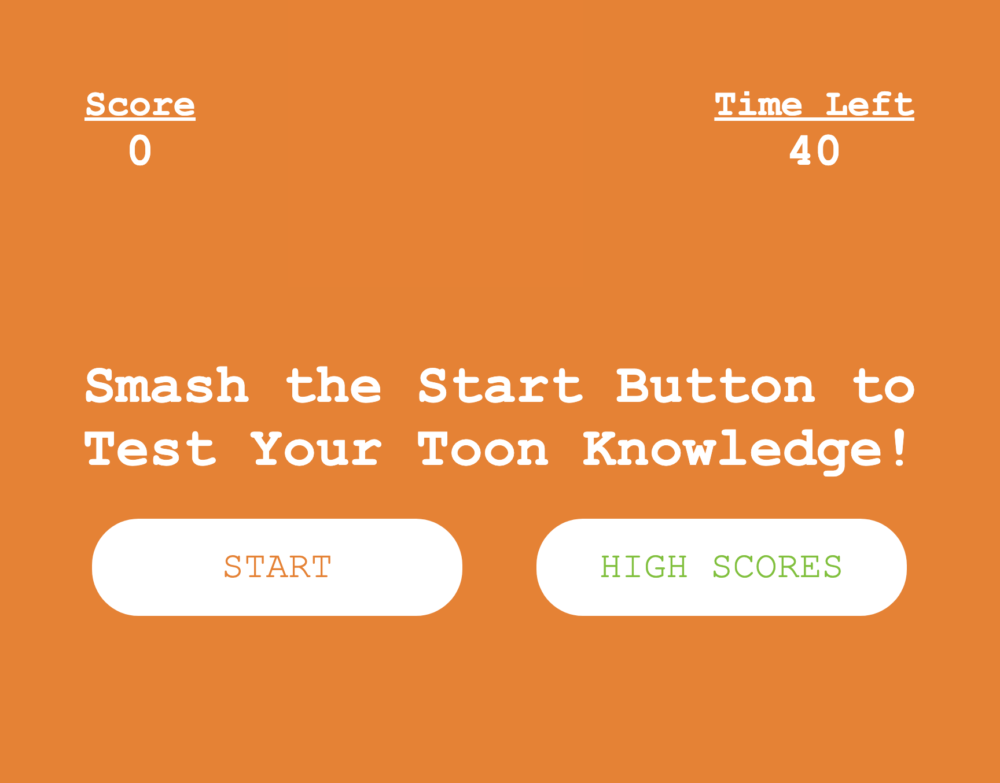
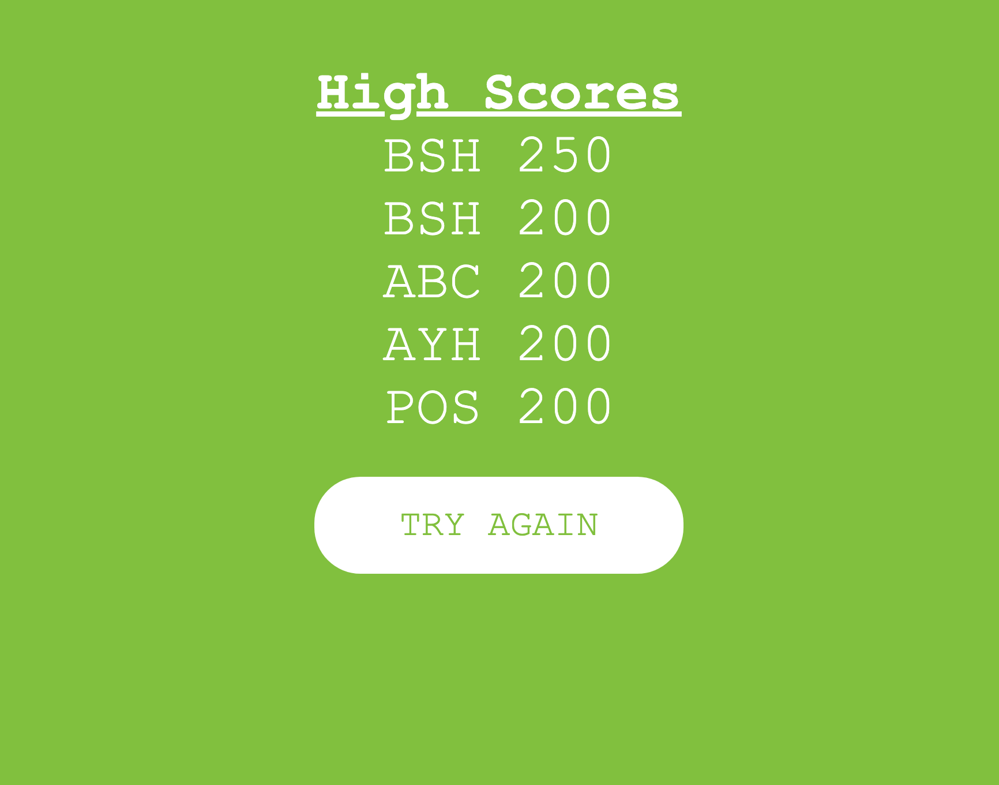
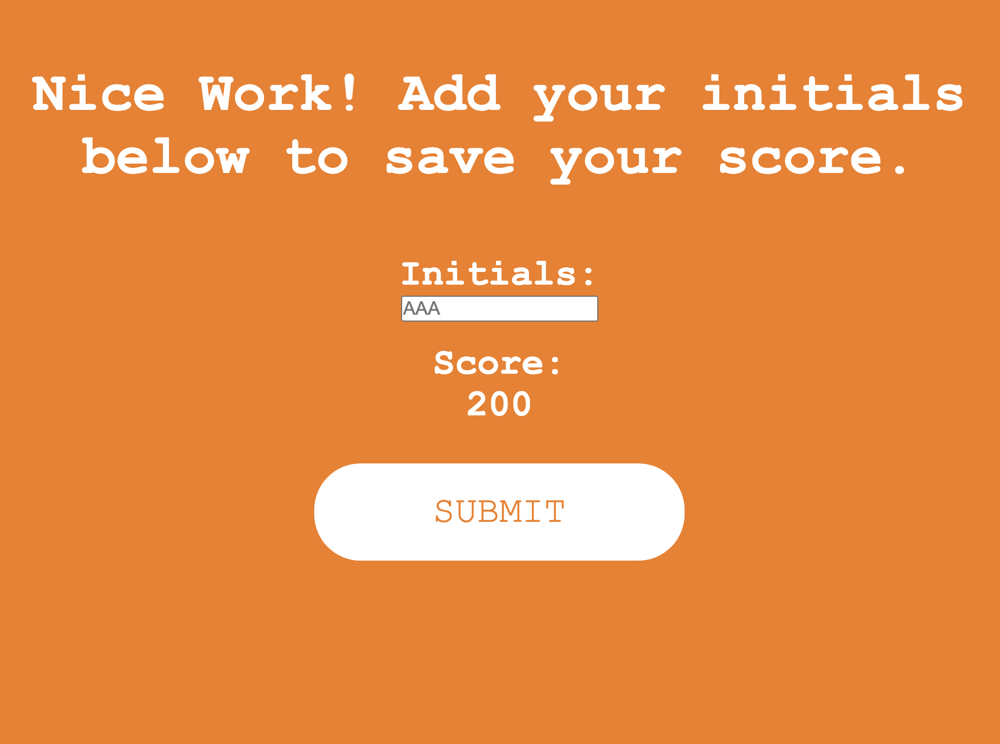

# Nickelodeon Quiz

Nickelodean quiz is a 5-question quiz that tests your toon knowledge. It allows users to save high scores and 

## Taking the Quiz

* Click Start button.
* The timer will count down from 40 and subtract 5 seconds if you get a question wrong.
* Click on the answers you think are correct. They will light up green if you click the right one and add 50 points to your score.
* The quiz will end if you don't finish before the timer hits 0. When the time is up or you have finished all five questions, you will be taken to a screen where you can enter your initials. Hit submit to save your score.
* The top five scores will show on the High Scores page

## Technologies

* HTML
* CSS
* Javascript

## Link

https://bhenry30.github.io/nickelodeon-quiz/

## Contributers

* Brandon Henry